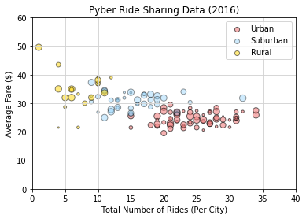

```python
# 3 Observations
# 1. The urban city type has a larger number of total rides which makes sense because of a denser population base
# 2. The urban city type also has a lot more drivers; again, denser population base drives demand for rides up which supply rises to meet the demand
# 3. The rural city type has a higher fare amount which also makes sense because the rides are more miles to get from point a to point b... couple this with the fact more people probably have cars and there is less demand for ride sharing we can also see that there are fewer drivers in the rural city type.
```


```python
# Import Dependencies
import matplotlib.pyplot as plt
import numpy as np
import pandas as pd
```


```python
pd.set_option("display.max_rows", 2500)
```


```python
# Load in csv
city_df = pd.read_csv("raw_data/city_data.csv")
ride_df = pd.read_csv("raw_data/ride_data.csv")
```


```python
# city_df.nunique()
# city_df.head()
```


```python
# ride_df.count()
```


```python
# merge two dataframes using an outer join
city_ride_df = pd.merge(city_df, ride_df, on="city")
# city_ride_df["type"]    
# city_ride_df["driver_count"]
```


```python
dupe_df=pd.DataFrame(city_ride_df.duplicated("date",keep="first"))
# 1934 - 1965 are the dupes
# dupe_df
```


```python
# drop dupes
city_ride_df.drop_duplicates("date", keep="first", inplace=True)
# city_ride_df.count()
# city_ride_df
```


```python
# avg fare per city
avg_fare_per_city = city_ride_df.groupby("city").mean()["fare"]
# avg_fare_per_city

urban_avg_fare_per_city = urban_df.groupby("city").mean()["fare"]
# urban_avg_fare_per_city

suburban_avg_fare_per_city = suburban_df.groupby("city").mean()["fare"]
# suburban_avg_fare_per_city

rural_avg_fare_per_city = rural_df.groupby("city").mean()["fare"]
# rural_avg_fare_per_city
```


```python
# total rides per city
total_rides_per_city = city_ride_df.groupby("city").count()["ride_id"]
# total_rides_per_city

urban_total_rides_per_city = urban_df.groupby("city").count()["ride_id"]
# urban_total_rides_per_city

suburban_total_rides_per_city = suburban_df.groupby("city").count()["ride_id"]
# suburban_total_rides_per_city

rural_total_rides_per_city = rural_df.groupby("city").count()["ride_id"]
# rural_total_rides_per_city
```


```python
# use original city file for drivers per city
driver_count_per_city = city_df["driver_count"]
# driver_count_per_city
```


```python
# urban avg fare
urban_avg_fare=urban_df.groupby("city").mean()["fare"]
# urban_avg_fare

# suburban avg fare
suburban_avg_fare=suburban_df.groupby("city").mean()["fare"]
# suburban_avg_fare

# rural avg fare
rural_avg_fare=rural_df.groupby("city").mean()["fare"]
# rural_avg_fare
```


```python
# city_ride_df ["city"].value_counts()
# print(city_ride_df.to_string())
```


```python
# city types

urban_df=city_ride_df[city_ride_df["type"]=="Urban"]
# urban_df.head()

suburban_df=city_ride_df[city_ride_df["type"]=="Suburban"]
# suburban_df.head()

rural_df=city_ride_df[city_ride_df["type"]=="Rural"]
# rural_df.head()
```


```python
# percent of total fares by city type

urban_percent_total_fare = urban_df.sum()["fare"]/city_ride_df.sum()["fare"]
# urban_percent_total_fare

suburban_percent_total_fare = suburban_df.sum()["fare"]/city_ride_df.sum()["fare"]
# suburban_percent_total_fare

rural_percent_total_fare = rural_df.sum()["fare"]/city_ride_df.sum()["fare"]
# rural_percent_total_fare
```


```python
# percent of total rides by city type

urban_percent_total_rides = urban_df.sum()["ride_id"]/city_ride_df.sum()["ride_id"]
# urban_percent_total_rides

suburban_percent_total_rides = suburban_df.sum()["ride_id"]/city_ride_df.sum()["ride_id"]
# suburban_percent_total_rides

rural_percent_total_rides = rural_df.sum()["ride_id"]/city_ride_df.sum()["ride_id"]
# rural_percent_total_rides
```


```python
urban_percent_total_drivers_by_city_type = city_ride_df[city_ride_df["type"]=="Urban"].sum()["driver_count"]/city_df.sum()["driver_count"]
# urban_percent_total_drivers_by_city_type

suburban_percent_total_drivers_by_city_type = city_ride_df[city_ride_df["type"]=="Suburban"].sum()["driver_count"]/city_df.sum()["driver_count"]
# suburban_percent_total_drivers_by_city_type

rural_percent_total_drivers_by_city_type = city_ride_df[city_ride_df["type"]=="Rural"].sum()["driver_count"]/city_df.sum()["driver_count"]
# rural_percent_total_drivers_by_city_type

# percent of total drivers by city type

# city_df.groupby("type").sum()["driver_count"]

# percent_total_drivers_by_city_type = city_df.groupby("type").sum()["driver_count"]/city_df.sum()["driver_count"]
# percent_total_drivers_by_city_type
```


```python
# The maximum x value for our chart will be 100
x_limit = 40


# Tells matplotlib that we want to make a scatter plot
# The size of each point on our plot is determined by their x value
urban_handle = plt.scatter(urban_total_rides_per_city, urban_avg_fare_per_city, marker="o", facecolors="lightcoral", edgecolors="black",
            s=driver_count_per_city, alpha=0.60, label="Urban")

suburban_handle = plt.scatter(suburban_total_rides_per_city, suburban_avg_fare_per_city, marker="o", facecolors="lightskyblue", edgecolors="black",
            s=driver_count_per_city, alpha=0.40, label="Suburban")

rural_handle = plt.scatter(rural_total_rides_per_city, rural_avg_fare_per_city, marker="o", facecolors="gold", edgecolors="black",
            s=driver_count_per_city, alpha=0.50, label="Rural")

plt.grid(color='lightgray', linestyle='-', linewidth=.895)


# The y limits of our scatter plot
plt.ylim(0, 60)

# The x limits of our scatter plot
plt.xlim(0, x_limit)

plt.legend(handles=[urban_handle, suburban_handle, rural_handle], loc="upper right")

# Create a title, x label, and y label for our chart
plt.title("Pyber Ride Sharing Data (2016)")
plt.xlabel("Total Number of Rides (Per City)")
plt.ylabel("Average Fare ($)")

# Prints the scatter plot to the screen
plt.show()
```





```python
# Labels for the sections of our pie chart
labels = ["Urban", "Suburban", "Rural"]

# The values of each section of the pie chart
sizes = [urban_percent_total_fare, suburban_percent_total_fare, rural_percent_total_fare]

# The colors of each section of the pie chart
colors = ["lightcoral", "lightskyblue", "gold"]

# Tells matplotlib to seperate the "Python" section from the others
explode = (0.1, 0, 0)

# Creates the pie chart based upon the values above
# Automatically finds the percentages of each part of the pie chart
plt.pie(sizes, explode=explode, labels=labels, colors=colors,
        autopct="%1.1f%%", shadow=True, startangle=140)

# Tells matplotlib that we want a pie chart with equal axes
plt.axis("equal")

plt.title("Percent of Total Fares by City Type")

# Prints our pie chart to the screen
plt.show()
```


```python
# Labels for the sections of our pie chart
labels = ["Urban", "Suburban", "Rural"]

# The values of each section of the pie chart
sizes = [urban_percent_total_rides, suburban_percent_total_rides, rural_percent_total_rides]

# The colors of each section of the pie chart
colors = ["lightcoral", "lightskyblue", "gold"]

# Tells matplotlib to seperate the "Python" section from the others
explode = (0.1, 0.25, 0.1)

# Creates the pie chart based upon the values above
# Automatically finds the percentages of each part of the pie chart
plt.pie(sizes, explode=explode, labels=labels, colors=colors,
        autopct="%1.1f%%", shadow=True, startangle=40)

# Tells matplotlib that we want a pie chart with equal axes
plt.axis("equal")

plt.title("Percent of Total Rides by City Type")

# Prints our pie chart to the screen
plt.show()
```


```python
# Labels for the sections of our pie chart
labels = ["Urban", "Suburban", "Rural"]

# The values of each section of the pie chart
sizes = [urban_percent_total_drivers_by_city_type, suburban_percent_total_drivers_by_city_type, rural_percent_total_drivers_by_city_type]

# The colors of each section of the pie chart
colors = ["lightcoral", "lightskyblue", "gold"]

# Tells matplotlib to seperate the "Python" section from the others
explode = (0.095, 0.0500, 0)

# Creates the pie chart based upon the values above
# Automatically finds the percentages of each part of the pie chart
plt.pie(sizes, explode=explode, labels=labels, colors=colors,
        autopct="%1.1f%%", shadow=False, startangle=240)

# Tells matplotlib that we want a pie chart with equal axes
plt.axis("equal")

plt.title("Percent of Total Drivers by City Type")

# Prints our pie chart to the screen
plt.show()
```


